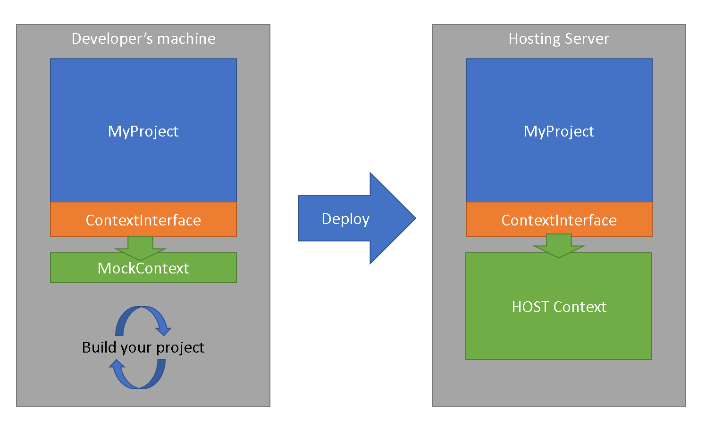

# Code injection at runtime in a dotnet core project
[Version Française](README_fr.md)
## Intro
Java is the first "object oriented" language I have learned; From 2015, I work mainly on dotnet projects; Java is regularly considered as an old dying language; But I constantly keep in mind things that are usual in this language, but are not possible in other languages.
In particular, in this article: Java enables people to inject dependencies at runtime, for example using CLASSPATH; 
The most well-known example is the usage of JDBC drivers: you can build a project planning to use database persistence, without having to choose at building time which Database (Oracle, Sybase, SQL Server, ...) you will use at runtime: Convenient JDBC driver will be provider by environment. This is really powerful because you can adapt your program's behavior regarding its hosting platform without having to modify it.

Such a thing was not possible in .NET Framework: all dependencies had to be "linked" inside your solution, when you built it. Consequently, you had to prepare a package by target platform, as soon as behavior had to be different.
Obviously, workaround are possible using configuration, and strategy patterns, but in that case, you had to embed all your strategies inside your package to just enable an option, or another...

This is not mandatory anymore in dotnet core; whith this new framework, which has a lot of similarities with JVM, it is possible from now on to inject libraries at runtime, which means you can include them WITHOUT link them in your project.
